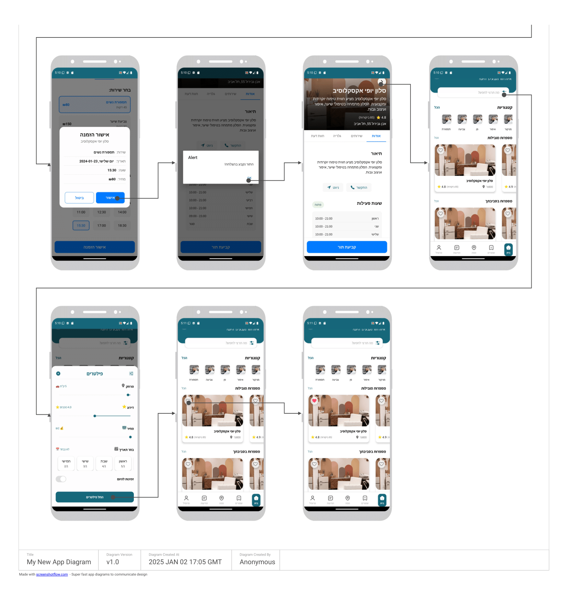
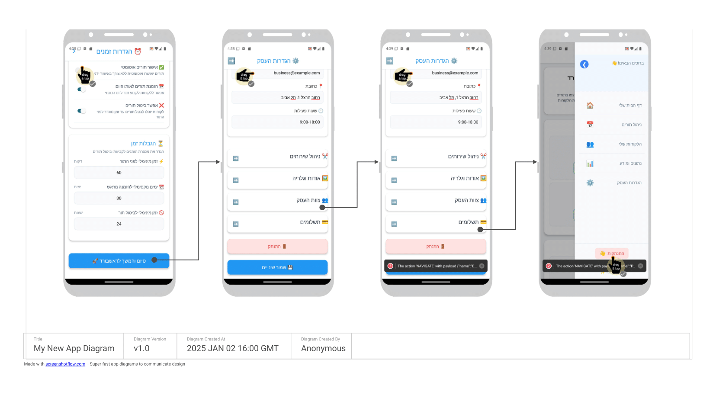

# Tori - Business Management and Appointments System
### [Project Demo Video](https://youtu.be/GYeKwG4_yJA?si=5IZWk-KVdEfRPLnd)


### Software Engineering Course Project
B.Sc in Computer Science @ Ariel University

## Authors
- Samuel Lazareanu - [LinkedIn](https://www.linkedin.com/in/samuellazareanu) | [GitHub](https://github.com/SamuraiPolix)
- Adiel Halevi - [LinkedIn](https://www.linkedin.com/in/adiel-halevi) | [GitHub](https://github.com/adiel098)
- Roey Shmilovich - [LinkedIn](https://www.linkedin.com/in/roey-shmilo) | [GitHub](https://github.com/RoeYeoR)

## About the Project
Search for businesses and book appointments on the same app, all in one place.
- Developed an advanced search feature for quick appointment booking
- Led full-cycle development using industry best practices, from initiation to deployment
- Integrated Firebase, Firestore, Storage, Functions, Messaging
- Designed UI/UX using Figma and managed project in a team of 3 using Trello

## Table of Contents
- [About](#about-the-project)
- [Screenshots](#screenshots)
- [System Requirements](#system-requirements)
- [Installation](#installation)
- [Firebase Setup](#firebase-setup)
- [Running the App](#running-the-app)
- [Features](#features)
- [Project Structure](#project-structure)
- [Development](#development)
- [Troubleshooting](#troubleshooting)
- [Contributing](#contributing)

## Screenshots

### Customer Flow
Here's the flow of screens from the customer's perspective:
(They are a bit changed in later versions, but the general idea is the same)

<div align="center">
  
  
</div>

- Welcome Screen
- Register/Login
- Customer HomePage
- Advanced Search Filters
- Quick Appointment Page
- My Appointments
- Saved/Favorite Businesses
- Business Page
- Appointment in SalonDetails

### Business Flow
Here's the flow of screens from the business's perspective:

<div align="center">
  
  
  
  
  
</div>

- Business Registration Steps
- Business Dashboard
- Business Calendar and Appointments Management
- Business Settings
- Stats Page

## System Requirements

- Node.js v22.11.0 or higher
- npm v11.1.0 or higher
- React Native development environment
- Android Studio (for Android development)
- Xcode (for iOS development, macOS only)
- Firebase project setup (Auth, Firestore, Storage, Functions, Messaging)

## Installation

1. Clone the repository:
```bash
git clone https://github.com/SamuraiPolix/Tori.git
cd Tori
```

2. Install dependencies:
```bash
npm install
```

## Firebase Setup

1. Create a new Firebase project at [Firebase Console](https://console.firebase.google.com)
2. Add your Android and iOS apps to the Firebase project
3. Download the configuration files:
   - `google-services.json` for Android (place in `src/services/`)
   - `GoogleService-Info.plist` for iOS (place in `src/services/`)
4. Enable the following Firebase services:
   - Authentication
   - Cloud Firestore
   - Cloud Storage

## Running the App

### Android

```bash
# Start Metro bundler
npm start

# In a new terminal, run on Android
npm run android
```

### iOS

```bash
# Start Metro bundler
npm start

# In a new terminal, run on iOS
npm run ios
```

## Running Multiple Emulators

To test both business and customer views simultaneously, you can run two emulators at the same time. Here's how:

### Starting Multiple Emulators

You can start multiple emulators either through command line or Android Studio:

#### Using Command Line:
```bash
# List available emulators
emulator -list-avds

# Start the first emulator
emulator -avd <Emulator_Name_1> &

# Start the second emulator
emulator -avd <Emulator_Name_2> &
```

#### Using Android Studio:
1. Open Android Studio
2. Go to Device Manager
3. Launch or duplicate an existing emulator
4. Start both emulators

### Verify Emulators
Check that both emulators are running:
```bash
adb devices
```

You should see something like:
```
List of devices attached
emulator-5554   device
emulator-5556   device
```

### Running the App on Both Emulators
Run these commands in separate terminals to start the app on each emulator:

```bash
# For the first emulator (e.g., for business view)
npx expo start --port 8082

# For the second emulator (e.g., for customer view)
npx expo start --port 8083
```

Then, press Shift + A to select the emulator on each terminal or open Expo Go on each emulator and you will see the Expo app running

This allows you to test business and customer interactions in real-time.

## Features

- 📅 Appointment Management
- 👥 Customer Management
- 💇‍♂️ Service Management
- 📊 Business Analytics
- ⚙️ Business Settings
- 🔔 Push Notifications

## Project Structure

```
Tori/
├── src/
│   ├── components/      # Reusable components
│   ├── screens/         # Screen components
│   ├── services/        # API and service functions
│   ├── styles/         # Global styles
│   └── assets/         # Images, fonts, etc.
├── android/            # Android specific files
├── ios/               # iOS specific files
└── package.json       # Project dependencies
```

## Development

- The app uses React Native for cross-platform mobile development
- Firebase is used for backend services
- RTL support is enabled for Hebrew language
- Follows modern React practices with hooks and functional components

## Troubleshooting

If you encounter any issues:

1. Clear Metro bundler cache:
```bash
npm start -- --reset-cache
```

2. Clean and rebuild Android:
```bash
cd android
./gradlew clean
cd ..
npm run android
```

3. Clean and rebuild iOS:
```bash
cd ios
pod deintegrate
pod install
cd ..
npm run ios
```

## Contributing

1. Fork the repository
2. Create your feature branch (`git checkout -b feature/AmazingFeature`)
3. Commit your changes (`git commit -m 'Add some AmazingFeature'`)
4. Push to the branch (`git push origin feature/AmazingFeature`)
5. Open a Pull Request